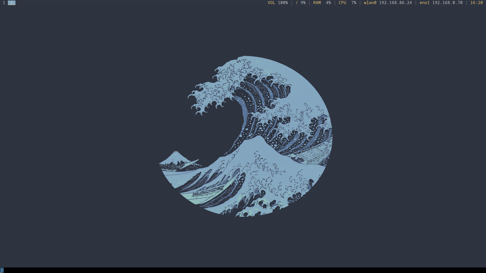
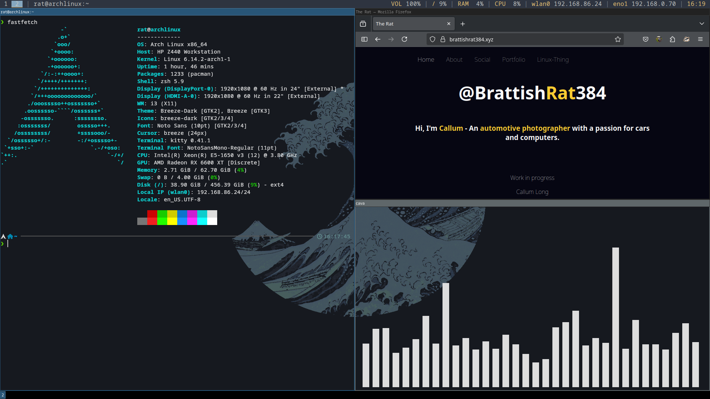

# I3 configs
- Configs for my simple I3 rice.
- Built for Arch Linux.

## Notes on build
- I3bar still loads but is disbled in config. Kept as Polybar (by default) does not show background tasks such as steam and discord.
- Some keybinds are diffrent from default I3.
- Kitty transparancy will not work without Picom.

## Dependencies
    sudo pacman -S rofi feh picom kitty i3 polybar dolphin i3lock pactl playerctl
- **Rofi**
    - A window switcher, Application launcher and dmenu replacement.
- **Feh**
    - Image viewer / wallpaper manager.
- **Picom**
    - Compositer (Required for kitty config.)
- **Kitty**
    - Terminal emululator.
- **I3**
    - Desktop.
- **Polybar**
    - Taskbar.
- **Dolphin**
    - File manager.
- **I3lock**
    - Lock screen for I3.
- **pactl**
    - Audio controller.
- **playerctl**
    - Keyboard audio input manager

## Optional
    sudo pacman -S kdeconnect cava fastfetch ranger nm-applet volumeicon && sudo sh -c "$(curl -fsSL https://raw.githubusercontent.com/ohmyzsh/ohmyzsh/master/tools/install.sh)"
- **KDE Connect**
    - Remote audio manager / notification manager. Connects with phone.
- **Cava**
    - Audio visualizer for terminal.
- **FastFetch**
    - Terminal based fetch tool. (Neofetch replacment.)
- **Ranger**
    - Terminal based file manager.
- **nm-applet**
    - Network manager applet.
- **Volume icon**
    - GUI audio manager.
- **OhMyZsh**
    - Shell for kitty.
    - Installed from curl

## External Imports
- **Rofi config** - [https://github.com/adi1090x/rofi/tree/master/files/launchers/type-7](https://github.com/adi1090x/rofi/tree/master/files/launchers/type-7)  
- **Wallpaper** - [https://papers.co/desktop/bj03-art-logo-wave-simple-minimal-dark/](https://papers.co/desktop/bj03-art-logo-wave-simple-minimal-dark/)  

# 

# Setup
- Install dependencies and optional above.
- Copy configs using:
    - **sudo cp ./config ./path/to/config**
- Refresh I3
    - **mod + shift + c**

# Keybinds:
- mod + B --> firefox
- mod + E --> dolphin
- mod + F1 --> mocp (music player)
- mod + Ctrl + O --> kill picom (Xorg interp)
- mod + Ctrl + l --> kill dunst (notif manager)
- print --> screenshot
- mod + Ctrl + X --> kill xorg
- mod + Q --> kill
- mod + C --> kitty (terminal)
- mod + tab --> rofi app menu
- Alt + tab --> rofi app switcher
- mod + h --> split hor
- mod + V --> split vert
- mod + F --> full screen
- mod + s --> stacking
- mod + w --> tab layout
- mod + space --> floating
- mod + shift + minus --> move focus to scratch pad
- mod + minus --> scratch pad show
- mod + ctrl + right --> next workspace
- mod + ctrl + left --> prev workspace
- mod + (1-9) --> workspace select
- mod + ctrl + (1-9) --> move container to workspace
- mod + shift + (1-9) --> move with focused
- mod + shift + C --> reload config
- mod + shift + R --> reload with current setup
- mod + shift + E --> exit
- mod + L --> Lock
- mod + shift + L --> mode select
- Mod + R --> resize
    - J --> shrink width 5px
    - K grow height 5px
    - ; growwidth 5px
    - L shrink height 5px
    - Up shrink height 10px
    - Down grow height 10px
    - Right Grow width 10px
    - Left shrink width 10px
    - esc / return --> exit resize mode
